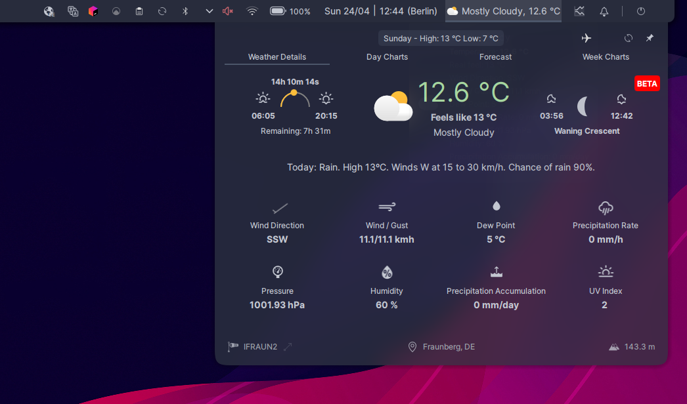
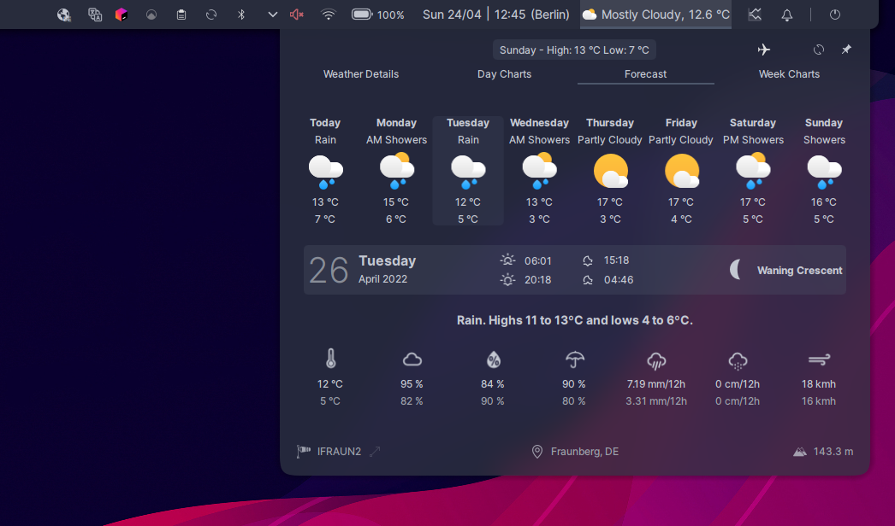
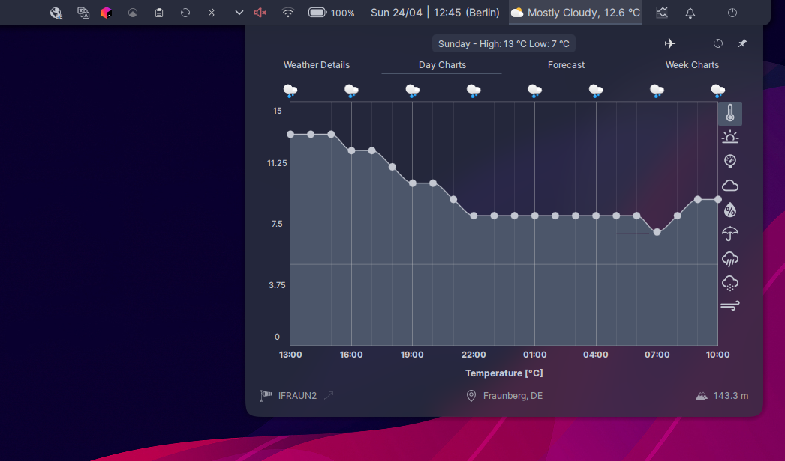
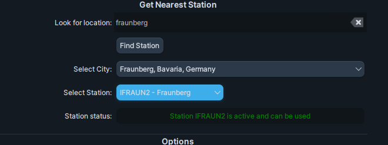
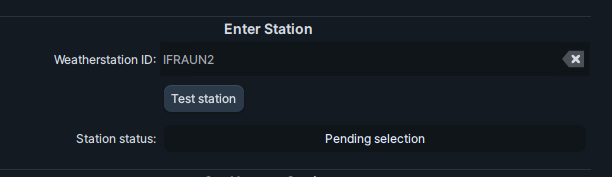

# Wunderground PWS Extended Widget for Linux KDE 5

### What is it?

It is a widget (Plasmoid) for KDE Plasma 5 that shows data from Wunderground [Personal Weather Stations](https://www.wunderground.com/pws/overview).
It's written in QML and JavaScript.

### How does it work?

It sits in your taskbar and periodically checks the current weather conditions as well as weather forecast for your location.

It also allows you to enable "I'm traveling" mode - in which, your "home" weather station will be ignored, and instead, the plugin will try to determine your location based on your public IP address at the time. It is useful when you're constantly traveling, when you go to another place over the weekend - you don't want to manually change the weather station every time, right? It's conceptually similar to adjusting your timezone automatically when your system detects you're in a different country now.

### Features
1.  High refresh rate of current conditions (as low as 15 seconds)
2.  Detailed current weather conditions
3. Two different views for weather details:
    - a leaner view with basic day (sun rise/set and moon rise/set)
    - an alternative view provides more information about the Sun's position, day length, time remaining until sunset, time since sunset and time to sunrise
4.  Detailed forecast charts for the next ~24 hours and 7 days.
    - icons above charts representing weather conditions at given time/day
    - day chart provides information about:
        - temperature
        - UV index
        - pressure
        - cloud cover
        - humidity
        - chance of rain
        - precipitation (rain and snow separately)
        - wind
    - week chart provides information about:
        - temperature
        - cloud cover
        - humidity
        - chance of rain
        - precipitation (rain and snow separately)
        - wind
5. The plugin displays location for which the weather info is provided (bottom bar)
6. "I'm traveling" mode, allows the widget to ignore your home station and automatically discover your location based on the public IP address. That is useful when traveling, e.g. you're going on a business trip to another location and you don't want to manually adjust your home station.

 

### How to configure?
You don't need to own a Weather Station yourself - there's a high chance there is already one in your neighbourhood. Feel free to look it up and use the ID of the nearest station.

#### Easiest method
The easiest way to set up is to use the configuration in the settings view. 

1. Enter the city you want to look for and press "Find Station"
2. The "Select city" dropdown will be populated, select the desired location
3. Upon selection the station dropdown will become populated - pick the station here
4. Once the station is selected, the plugin will check if it is active. Sometimes the station is no longer active (powered off) - then you'll need to select a different station.

#### I know what I'm doing method
If you own a weather station and you know it's station ID or you want to look for a station manually you can use 

1. Either enter the Weatherstation ID from memory or go to https://www.wunderground.com/wundermap
2. On the website, look for the city/region, etc.
3. From the map, pick the bubble that is closest to you
4. A pop-up will appear with a Weatherstation in it. PLEASE NOTE: it is case-sensitive.
5. Copy the Weatherstation ID into the "Weatherstation ID" field in the plugin
6. **Press "Test station" button**
7. The plugin will test the weather station 
    - if it's all green, you're good to go, Apply the settings
    - if it says "weather station not active", you need to select another station ID from the wunderground website

### Does it gather any info about me?
NO! But please bear in mind, when "I'm traveling" mode is enabled, then it will use a public service https://ipinfo.io to determine your location.

### Are you affiliated with Wunderground?
No.

## History
This is an extended version of Wunderground Plasmoid - originally written by Kevin Donnelly (https://github.com/k-donn/plasmoid-wunderground). Huge thanks for the inspiration and a great base to work on. 

At this point the codebases diverged significantly - around 80% of the original code has been changed and is authored by me.

## Bugs

Please report bugs through:
- GitHub issues https://github.com/rliwoch/plasmoid-wunderground-extended/issues/new/choose
- directly on email rafal.liwoch@gmail.com

## Translating

Translations welcome!

Follow the file in [plasmoid/translate](./plasmoid/translate) for directions.

#### Existing translations:
* Polish
* Spanish, thanks to [Solofolo](https://github.com/Solofolo)
* French, thanks to Parviz
* Indonesian, thanks to [Adam Adrian](https://github.com/adam-adrian)
* Dutch, thanks to [Heimen Stoffels aka Vistaus](https://github.com/Vistaus)

#### Please contribute your translation

##### Can't be easier method 

1. If you don't know **anything** about github/coding/etc. just take this file: [CLICK](https://raw.githubusercontent.com/rliwoch/plasmoid-wunderground-extended/main/plasmoid/translate/template.pot)
2. Open the file in ANY text editor
3. fill in the blanks  `msgstr` in your language
4. send the text file directly to my email

##### I know what I'm doing method
1. head over to [translations readme](plasmoid/translate/ReadMe.md) 
2. fork repo
3. create a new branch `feature/your_language` of `develop`
4. submit a pull request AGAINST `develop` in this repository

## Thanks to

- Kevin Donnelly (https://github.com/k-donn/plasmoid-wunderground) for his original project and work.
- Erik Flowers for his great weather icons https://erikflowers.github.io/weather-icons/
- Peter Schmalfeldt for colourful weather icons in SVG https://github.com/manifestinteractive/weather-underground-icons (MIT license)
- Grabster for additional set of material-design-like icons in SVG https://github.com/Grabstertv/WeatherNowIcons (CC BY-SA 4.0 license)
- Meteocons for additional weather icons (https://www.alessioatzeni.com/meteocons/)

## TODO

- More translations - PLEASE CONTRIBUTE!!!
- Localised wind direction
